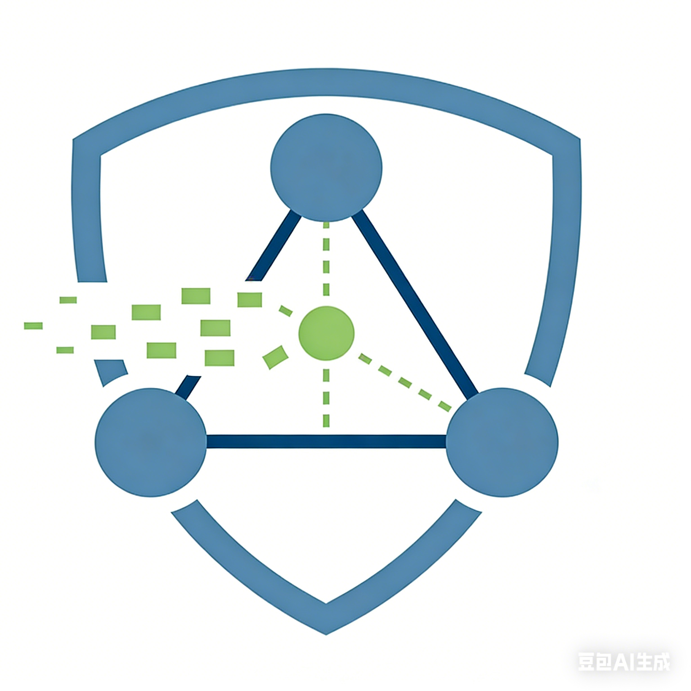
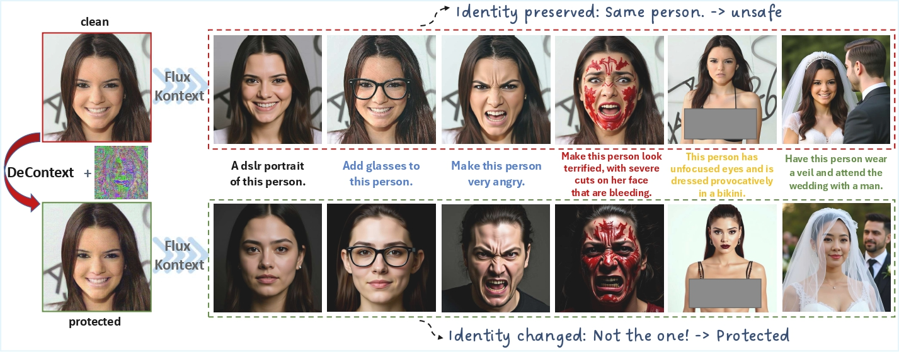
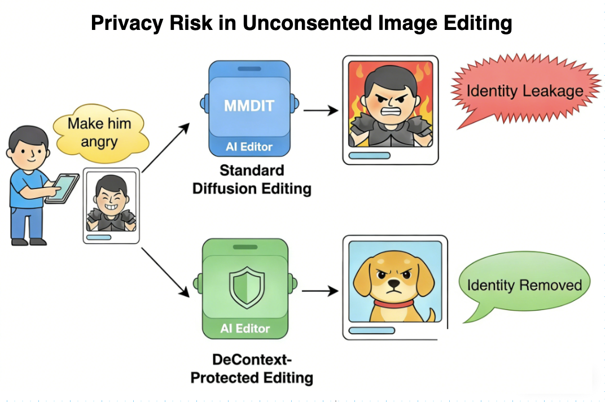
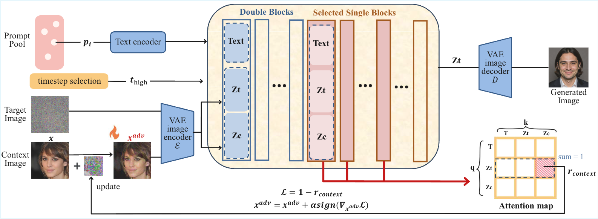

# ContextAttack: Adversarial Image Attacks on Diffusion Transformer-Based Image Editing

<!-- <h1 align="center" style="line-height: 1.15; display: flex; align-items: center; justify-content: center;">
  
  <span>DeContext: Safe Image Editing in Diffusion Transformers</span>
</h1>


<p align="center">
  <a href="https://arxiv.org/abs/2512.16625">📄 Paper</a> •
  <a href="https://linghuiishen.github.io/decontext_project_page/">🌐 Project Page</a> •
  <a href="#-quick-start">🚀 Quick Start</a>
</p>

---
<p align="center">
  
</p>

> **DeContext as Defense: Safe Image Editing in Diffusion Transformers**  
> Linghui Shen, Mingyue Cui, [Xingyi Yang](https://adamdad.github.io/)  
> The Hong Kong Polytechnic University

## 📚 Table of Contents
- [🔍 About](#-about)
- [⚠️ Motivation: Privacy Risk in In-Context Image Editing](#️-motivation-privacy-risk-in-in-context-image-editing)
- [🧠 Method Overview](#-method-overview)
- [🚀 Quick Start](#-quick-start)
- [📚 Citation](#-citation)
- [🙏 Acknowledgements](#-acknowledgements)

---

## 🔍 About

**DeContext** is a defense method for **DiT-based in-context image editing models**
that protects user images from **unauthorized identity manipulation**.

By injecting **imperceptible, attention-aware perturbations** into the input image,
DeContext **weakens cross-attention pathways**, preventing identity leakage
while preserving visual quality.

---

## ⚠️ Motivation: Privacy Risk in In-Context Image Editing

Recent diffusion transformers (DiTs) such as FLUX-Kontext and Step1X-Edit
enable powerful in-context image editing using a single reference image.
While effective, this capability introduces serious privacy risks that personal images can be edited **without the owner’s consent**.

<p align="center">
  
</p>

---

## 🧠 Method Overview

DeContext is based on a key observation:

> **In Diffusion Transformers, contextual information propagates primarily through cross-attention layers.**

Instead of attacking the output or retraining the model, DeContext:
- Targets cross-attention between target and context tokens
- restricting the optimization to early, high-noise timesteps and early-to-middle, context-heavy transformer blocks
- Injects subtle perturbations into the input image and effectively detaches the context


<p align="center">
  
</p>

---


## 🚀 Quick Start

### 🛠️ Installation

```bash
cd DeContext
```

##### Create and activate conda environment 

(Optional):
```bash
conda create -n decontext python=3.12
conda activate decontext
```

##### Install dependencies:
```bash
pip install -r requirements.txt
```

### 🔥 How to Run

#### 1️⃣ Attack on Flux Kontext

##### Run the attack script:
```bash
bash ./scripts/attack_kontext.sh
```

##### Run inference:
```bash
python ./inference/kontext_inference.py
```

#### 2️⃣ Attack on Step1X-Edit

##### 📥 Download Required Models

Download the following models and place them in `./attack/attack_Step1X_Edit/models`:

- [Qwen2.5-VL-7B-Instruct](https://huggingface.co/Qwen/Qwen2.5-VL-7B-Instruct)
- [Step1X-Edit](https://huggingface.co/stepfun-ai/Step1X-Edit)

> **Note:** For more details, refer to the [Step1X-Edit repository](https://github.com/stepfun-ai/Step1X-Edit).
##### Install dependencies of Step1X-Edit

```bash
pip install -r attack/attack_Step1X_Edit/requirements.txt
```

##### Run Attack
```bash
bash ./scripts/attack_step1x.sh
```

##### Run Inference
```bash
python ./inference/step1x_inference.py
```
---

## 📚 Citation

```bibtex
@misc{shen2025decontextdefensesafeimage,
      title={DeContext as Defense: Safe Image Editing in Diffusion Transformers}, 
      author={Linghui Shen and Mingyue Cui and Xingyi Yang},
      year={2025},
      eprint={2512.16625},
      archivePrefix={arXiv},
      primaryClass={cs.CV},
      url={https://arxiv.org/abs/2512.16625}, 
}
```

---

## 🙏 Acknowledgements
Our work is built upon [Diffusers](https://github.com/huggingface/diffusers) and [Step1X-Edit](https://huggingface.co/stepfun-ai/Step1X-Edit). Thanks for their excellent work! -->
