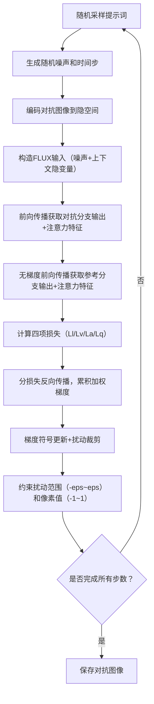

# 上下文攻击v5 (Context Attack v5) 说明文档
## 1. 概述
Context Attack v5 是针对 FLUX.1-Kontext 模型的对抗攻击算法，核心目标是通过对输入的条件图像（Context Image）施加微小扰动，强制模型无视任意文本提示词，固定输出指定身份（张三）的指定表情（张嘴笑），实现**身份保留+表情锁定+文本提示失效**的对抗效果。

该版本在 v4 基础上聚焦特征对齐，移除了上下文损失（Lc），优化了梯度累积策略，并针对 FLUX 模型的双分支 Transformer 结构（Double Block + Single Block）设计了专属的注意力对齐损失，提升攻击的通用性和稳定性。

## 2. 核心功能
### 2.1 核心目标
- **身份保留**：对抗扰动后的图像仍能保持目标人物（张三）的核心身份特征；
- **表情锁定**：强制模型输出“张嘴笑”的固定表情，不受文本提示词影响；
- **文本失效**：使 FLUX 模型忽略任意编辑类文本提示（如表情修改、配饰添加、场景更换等）；
- **通用扰动**：扰动对多种编辑提示词均有效，而非过拟合单一提示。

### 2.2 关键特性
| 特性 | 说明 |
|------|------|
| 双编码器适配 | 针对 FLUX 的 CLIP+T5 双文本编码器，实现提示词的完整编码与对齐； |
| 分层注意力对齐 | 针对 FLUX 的 Double/Single Block 结构设计差异化的注意力损失； |
| 梯度安全累积 | 分损失反向传播，避免梯度爆炸，提升优化稳定性； |
| 通用提示池 | 内置 60+ 种编辑类提示词，优化过程随机采样，保证扰动通用性； |
| 混合精度支持 | 支持 FP16/BF16 混合精度训练，降低显存占用； |
| 灵活的层选择 | 支持自定义注意力层范围，适配不同攻击需求； |

## 3. 核心模块详解
### 3.1 数据集模块（AdversarialDataset）
专门用于加载对抗攻击所需的条件图像和参考图像，核心特性：
- 仅加载图像数据，无需标签；
- 支持条件图像（待攻击）与参考图像（目标表情/身份）的一一对应；
- 统一的图像预处理流程：Resize → CenterCrop → ToTensor → Normalize（均值0.5，方差0.5）；
- 支持自定义分辨率（默认512×512）。

### 3.2 提示词编码模块（encode_prompt_flux）
适配 FLUX 模型的双文本编码器架构，输出模型所需的完整文本嵌入：
1. **CLIP 编码器**：生成全局语义特征（pooled_embeddings），维度 [B, C]；
2. **T5 编码器**：生成 Token 级语义特征（prompt_embeds），维度 [B, L, C]；
3. **RoPE 适配**：生成文本 ID（text_ids），用于旋转位置编码（Rotary Embedding）。

### 3.3 注意力钩子模块（AttentionHook）
用于捕获 FLUX Transformer 内部的 Q/K 归一化特征，为注意力损失计算提供数据：
- 支持指定关注的 Transformer 层（默认 Single Blocks 0-25）；
- 分别捕获 Double Block 和 Single Block 中的 Q（q_norm）、K（k_norm）特征；
- 提供钩子注册/清除接口，避免内存泄漏。

## 4. 损失函数设计
### 4.1 损失函数总览
总损失为各分项损失的加权和：
$$ L_{total} = w_l \cdot L_l + w_v \cdot L_v + w_a \cdot L_a + w_q \cdot L_q $$
其中：
- $w_l$：隐空间损失权重（默认0.1）；
- $w_v$：预测损失权重（默认10.0）；
- $w_a$：注意力对齐损失权重（默认0.0001）；
- $w_q$：Q/K 特征损失权重（默认1.0）。

### 4.2 分项损失详解
#### 4.2.1 隐空间损失（$L_l$）
**目标**：对齐对抗图像与参考图像的底层视觉特征，保证身份/基础视觉特征一致。
**计算方式**：MSE 损失，对比对抗图像（adv）和参考图像（ref）经 VAE 编码后的隐空间特征：
$$ L_l = \text{MSE}(\text{cond\_latents}_{adv}, \text{cond\_latents}_{ref}) $$
其中 `cond_latents` 是图像经 VAE 编码并缩放/偏移后的隐变量。

#### 4.2.2 预测损失（$L_v$）
**目标**：对齐模型最终输出的预测特征，强制对抗分支输出参考分支的目标表情（张嘴笑）。
**计算方式**：MSE 损失，对比对抗分支和参考分支的 Transformer 预测输出：
$$ L_v = \text{MSE}(\text{pred}_{adv}, \text{pred}_{ref}) $$
其中 `pred` 是 FLUX Transformer 对含噪隐变量的预测结果。

#### 4.2.3 注意力对齐损失（$L_a$）
**核心创新点**：针对 FLUX 双分支 Transformer 结构设计的注意力对齐损失，强制模型忽略文本提示，锁定目标表情。
**计算逻辑**：
1. **Double Block（序列长度2048）**：
   - 分区：目标区域（0-1023）、上下文区域（1024-2047）；
   - 对 Q/K 应用 RoPE 编码，计算注意力矩阵；
   - 对齐目标区域到上下文区域的注意力分布：$L_a^{double} = \text{MSE}(c_{attn}, c_{attn}^{ref})$。

2. **Single Block（序列长度2560）**：
   - 分区：文本区域（0-511）、目标区域（512-1535）、上下文区域（1536-2559）；
   - 对 Q/K 应用 RoPE 编码，计算注意力矩阵；
   - **关键修改**：仅对齐目标区域到文本区域的注意力分布（废掉文本提示的影响），删除上下文注意力对齐：
     $$ L_a^{single} = \text{MSE}(\text{text\_attn}, \text{text\_attn}^{ref}) $$

3. **最终注意力损失**：
   $$ L_a = \frac{1}{N_{attn}} \sum (L_a^{double} + L_a^{single}) $$
   其中 $N_{attn}$ 是有效注意力层数量。

#### 4.2.4 Q/K 特征损失（$L_q$）
**目标**：对齐对抗分支与参考分支的 Q/K 特征本身，进一步强化特征一致性。
**计算方式**：对所有捕获的 Q/K 特征计算 MSE 损失并平均：
$$ L_q = \frac{1}{N_{qk}} \sum_{name \in \{Q,K\}} \text{MSE}(\text{adv\_qkv}[name], \text{ref\_qkv}[name]) $$
其中 $N_{qk}$ 是有效 Q/K 特征数量。

## 5. 算法流程
### 5.1 预处理阶段
1. **模型加载**：加载 FLUX.1-Kontext 的 VAE、Transformer、CLIP/T5 文本编码器；
2. **数据集初始化**：加载条件图像（待攻击）和参考图像（目标表情）；
3. **提示词池预编码**：
   - 对抗分支：预编码 60+ 种编辑提示词（如“添加眼镜”“改变表情”等）；
   - 参考分支：预编码拼接目标表情后缀的提示词（如“Make this person smile..., 张嘴笑”）；
4. **参数初始化**：设置随机种子、设备（CUDA/CPU）、混合精度模式等。

### 5.2 对抗优化阶段（核心循环）
对每张图像执行 `attack_steps` 次优化（默认500步）：

#### 关键步骤说明：
1. **梯度累积策略**：
   - 对每个损失分项单独反向传播，避免梯度爆炸；
   - 累积各损失的加权梯度后统一更新；
   - 每次反向传播后清零梯度，保证独立性。

2. **扰动约束**：
   - 梯度符号更新：`adv = adv - alpha * grad.sign()`，提升优化稳定性；
   - 扰动范围限制：`eta = clamp(adv - original, -eps, eps)`；
   - 像素值限制：`adv = clamp(original + eta, -1, 1)`。

### 5.3 后处理阶段
1. 将对抗图像从张量转换为 PIL 图像；
2. 保存到指定输出目录，保持原文件名；
3. 结束 WandB 日志（若启用）。

## 6. 关键参数说明
| 参数名 | 类型 | 默认值 | 说明 |
|--------|------|--------|------|
| pretrained_model_name_or_path | str | black-forest-labs/FLUX.1-Kontext-dev | FLUX 模型路径 |
| condition_images_dir | str | - | 待攻击的条件图像目录 |
| reference_images_dir | str | None | 参考图像（目标表情）目录 |
| output_dir | str | - | 对抗图像输出目录 |
| attack_steps | int | 500 | 攻击优化步数 |
| alpha | float | 0.005 | 步长 |
| eps | float | 0.1 | 最大扰动范围（像素值归一化后） |
| seed | int | 42 | 随机种子 |
| w_l | float | 0.5 | 隐空间损失权重 |
| w_v | float | 1.0 | 预测损失权重 |
| w_a | float | 1.0 | 注意力对齐损失权重 |
| w_q | float | 0.2 | Q/K 特征损失权重 |
| device | str | None | 运行设备（自动选CUDA/CPU） |
| mixed_precision | str | no | 混合精度模式（no/fp16/bf16） |
| prompt_mode | str | default | 提示词模式（single/multi） |
| ref_prompt_suffix | str | 固定表情后缀 | 参考分支提示词后缀（强制目标表情） |
| attn_layers | str | 0-25 | 关注的注意力层（如0-25或0,1,2） |

## 7. 核心创新与改进
1. **FLUX 专属注意力损失**：针对 Double/Single Block 不同的序列长度和分区策略，设计差异化的注意力对齐逻辑，精准废掉文本提示的影响；
2. **梯度安全优化**：分损失反向传播+梯度累积，解决梯度爆炸问题，提升优化稳定性；
3. **通用提示池**：60+ 种编辑提示词随机采样，避免过拟合单一提示，保证扰动的通用性；
4. **预编码提示词**：提前编码所有提示词，释放文本编码器显存，提升运行效率；
5. **灵活的层选择**：支持自定义注意力层范围，适配不同攻击场景的需求。

## 8. 运行环境依赖
- Python 3.8+
- PyTorch 2.0+
- diffusers >= 0.28.0
- transformers >= 4.38.0
- torchvision、Pillow、tqdm、numpy、wandb（可选）

## 9. 典型使用场景
- 对抗性图像保护：使目标图像在 FLUX 模型中无法被任意文本提示修改表情/特征；
- 模型鲁棒性测试：评估 FLUX.1-Kontext 模型对上下文图像扰动的鲁棒性；
- 可控生成研究：探索文本提示与上下文图像在 FLUX 模型中的交互机制。